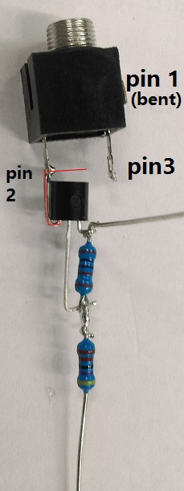

# Guess That Song Game
_Sight and Sound_


Turn your living room into a real life game show and have fun playing with your family and friends! Prepare some mp3 files to play and try to score the most amount of points with an automatic game app on the raspberry Pi. See who has the most musical knowledge between songs of today and yesteryear.

_Note, Printed copy in this month's catalogue has incorrectly mentioned SD cards and LCD screens which were present on version 0.1 of this project. This project now requires a TV or monitor connected to the raspberry Pi and assumes that you have audio output present._

## Bill of Materials

|Qty| Product| Description|
|---|---|---|
|1 | [XC9000](http://jaycar.com.au/p/XC9000) | Raspberry Pi
|1 | [XC9002](http://jaycar.com.au/p/XC9002) | Case for rPi
|8 | [PS0132](http://jaycar.com.au/p/PS0132) | Stereo Sockets (4 on base, 1 per controller)
|4 | [HB6015](http://jaycar.com.au/p/HB6015) | Jiffy boxes for controllers
|4* | [SP0662](http://jaycar.com.au/p/SP0662) | Red Arcade button ( Use multiple colours if desired, you need 1 per controller)
|4 | [WA7009](http://jaycar.com.au/p/WA7009) | 3.5mm Stereo male-male lead, 3m different lengths if required.
|1 | [ZT2110](http://jaycar.com.au/p/ZT2110) | PNP transistor BC327
|1 | [RR0596](http://jaycar.com.au/p/RR0596) | 10k Resistor pack
|1 | [RR0582](http://jaycar.com.au/p/RR0582) | 2.7k Resistor pack

## Circuit Diagrams


This is the main circuit understanding for the project, you can see that there are two signals on the left hand side which are Input/Output (per controller) followed by a resistor/transistor network, then to the connector which is copied over onto the controller side. Pin 3 of the 3.5mm connector is the signal in, that will get connected to ground when the button is pressed. Pin 2 of the connector is the transistor network that feeds the LED of the controller the 5v from the supply.

#### Transistor network
The GPIO of the raspberry Pi can only give out 3v3 signals, with not a lot of current. This is unfortunate as the LEDs in the arcade button are designed to be used with 12V (but 5V seems to work fine) and lighting up all 4 controllers at once will most likely ask for too much power from the raspberry Pi, so we have used a PNP transistor and a voltage divider circuit here to act as a switch, so that the power comes from the 5V rail ( USB power supply) rather than the internal logic chips in the rPi.


We won't go too far into transistors here, as they're a subject in and of themselves, with plenty of better material out there. but for the time being we can suffice with some basic information:
* Transistors need at least 0.7V on the base with respect to the collector to activate.
* When activated, they can open the connection between Collector and Emitter.

With our set up, we use a voltage divider between the 5V rail and the 3v3 GPIO output. When the GPIO gives a `HIGH` reading, (3.3v) the voltage over the resistors in the divider is 1.7v, which splits according to the voltage divider:
```
1.7 * (R6)/(R5+R6) = 1.7 * (2.7k)/(12.7k) = 1.7 * 0.213 = 0.3621 volts
```
When the GPIO is `LOW`, the voltage divider has 5V on one side and 0V on the other, so the full 5V is being divided:
```
5 * (R6)/(R5+R6) = 5 * 0.213 = 1.065 volts
```


## Assembly
This project has two main parts, the main unit and the controllers (four of them)

#### Controller


The Controller is a relatively simple set up, you are connecting the arcade button's switch and LED to the socket connector for the cable to connect to.


Pin 1 is the ground connection, with pin 2 being the +5V coming in, and pin 3 is the switch connection back to the main unit.

If you want, you can solder the connections and make sure that the unit works before assembling it into a case.

1. You'll notice that once you place the switch in the switch housing (connect the shorter pin in first, then swing the rest of the switch in so the taller pin can clip in) you will have two wings out the side of the switch. these are for the LED. Connect Pin 2 of the connector to one of them, and connect the other to the bottom pin of the switch (`COM` - for "Common")

2. Then connect the `NO` pin of the switch (middle pin of the 3, should be marked "NO") to Pin 3 of the socket connector, and connect `COM` to Pin 1.

You should now have something that looks like this:


3. In terms of the case, you drill a 5mm hole on one side for the socket connector, and a larger 45mm hole for the button to fit through.

With the case as chosen, I wasn't able to fit the thread screw onto it while it is still in the case, so I went without the screw and used some super-glue instead.


_Drill out the hole and place the switch housing in. you'd probably want to use super glue up around where the green is in the picture. There is a little bit of overhang but it's not a big concern_

4. Then just place the unit in the housing, clip into the button assembly and mount the socket sticking out of the other end


_one controller finished, 3 more to go_

#### Main unit assembly

Here is where the tricky part is. you're going to make 4x of the same part for each of the controllers, and there's not a lot of room in the case, but it is doable.

If you want to provide your own case, feel free to do so and use the schematic above. These instructions below are to get it fitting into the tiny XC9002 case, but if you have more room to play you won't have to be so tight.

Scroll down further for the finished look if you want to start with the end in mind.

##### Important
notice that there is a resistor between the collector and the base pin. This can be confusing below, but look at the diagrams and pinouts to ensure that you have the connections right, especially if you have never played around with transistors before.


1. Start by twisting two resistors together, one from each pack, and place a neat blob of solder to join them together like such:


_note, in my prototype, I used 1k and 4k7 valued resistors. you will find that the values are fairly similar for voltage dividing purposes._

clip the offshoots of the twist and keep them aside for later.

Recall the pinout of the transistors:

_note, this isn't the same for every transistor, but most of them should be similar_

Looking at the face of the transistor, left to right, you have the collector, base, and then emitter.

2. bend the collector at a 90deg right angle so that it is fanning out to the left, same for the emitter.

3. Then place the resistors near the collector so that the smaller valued resistor (2.7k) can lay alongside the base pin, and wrap around the collector pin so that it can be soldered and then clipped off. Bend the bottom of the base pin to connect to the join of the two resistors. Refer to picture:


4. bend the lead of the resistor up behind the transistor, and bend the emitter up again so it looks like it is saluting, and place in the pin 2 of the socket connector, before soldering and clipping off the excess.


_the red in this diagram highlights how the emitter pin was bent before clipping off the excess_

5. Finally, bend Pin 1 of the socket connector close to the body of the socket, so that you can fit multiple units in.

that is now 1 single unit. Do 3 more times.

#### Fitting to housing

It is a tight fit, but entirely possible to fit the 4 socket connectors as well as the circuitry into the tiny XC9002 case.

First step is to drill out the spaces from the front-grill. Here we've marked the places to drill (in red):


Make sure you're looking at the correct side of the front grill. you'll notice there is a little notch where they give space so you can pull out the SD card of the assembled unit.
With the rightmost hole, I have marked (in orange) an alternative position, which would make for closing the case easier, however the circuitry will be closer to the HDMI socket and so you will have to isolate and make sure that the circuits do not touch by using electrical tape or similar.

Drill out the holes, then attach the 4 socket units:


Here, we have also attached a small hook to each of the pin 1 of the socket connectors as I attached them, so that we can bridge these connections later. these were from the small resistor leads that we clipped back when we attached the two resistors together.


Finally, connect all the Pin 1 leads together, and all the collector leads together, so you get something that looks like the following:


you now have finished your front grill assembly.
Cut up some female jumper leads or similar so that you can connect to the rPi GPIO header connector.

The end of each resistor lead is the output to the LED for the controllers, and the unconnected Pin 3 of each socket adapter is the input from the switch. Using some heat shrink at this point is also a good idea as it keeps things mechanically secure and electrically isolated.

Our final unit looks something like this, with heat-shrink attached:


This is our pin-out, you can deviate from this if you want, but you'll have to change the code in `config.py`


Code in `config.py`:
```python

#set these to the GPIO pins, in order of player 1,2,3,4:
button_pins = [21,9,10,11] #Input button pins
led_pins = [26,19,13,6] #Output LED pins
'''
the idea would be, if the led and buttons are in the form of
[a,b,c,d]
[e,f,g,h]
the zip function will bring it to:
[
  (LED(a), Button(e)),
  (LED(b), Button(f)),
 ... ]
'''
players = list(zip([LED(l) for l in led_pins],
            [Button(b) for b in button_pins]))

```
#### Making it fit in the case

the only final issue now is getting the whole thing in the case. Unfortunately, with having 4 controller ports, the final port is blocking one of the support beams holding down the case. Use a pair of side-cutters and trim down the beam so that it's almost as flush as the case.


At this point you will be able to try and fit the case together, first by putting the rPi in the base, and sitting the front-grill in on top. Connect the header pins to where you want them, and sit the roof of the case on top. you should be able to screw in the 3 remaining supports and depending on how neat everything is, you should have a pretty neat little unit.


## Programming

The code is entirely on github with a setup script.

You can easily download and install it by using:

```bash
git clone http://github.com/duinotech/Guess-That-Song-Game

bash ./Guess-That-Song-Game/setup.sh
```

The code should have a number of comments for you to look at and try to understand, we are using 4 main libraries here:

* `pygame` - to provide us with audio output
* `appJar` - easy GUI interface
* `gpiozero` - interface to the rPi GPIO
* `eyeD3` - MP3 file tag reading.

the setup script will install these for you and make an icon on the desktop.


## Use

* _note, while it was attempted to have as little interaction with the keyboard as possible, it's needed so that players can't give themselves points to win, so the `MC` of the night will have to have a keyboard to press enter or space at certain points of the game_


To use the app, run the icon on the desktop, you will then be presented with a startup screen.


Here you can set the folder of where your music files are, which it will then play from.

Each black screen will guide you and ask you what's playing, one of the players must use the controller to pause the music (their controller will light up) and they have their moment to speak, otherwise they can give up (long press on controller) or the `MC` can hit `enter` to show the song on the screen, which the player will get a point or not if they get it correct or not.


Finally, after all songs have played through or the `MC` presses `escape` - the score screen will show with a log history of who got what correct.


## Future Improvements
* There's a way to use the python `PIL` library to display images on `appJar` guis, maybe an idea would be to show the album art aswel.

* Make another controller port for the `MC` which operates on a different controller layout.
